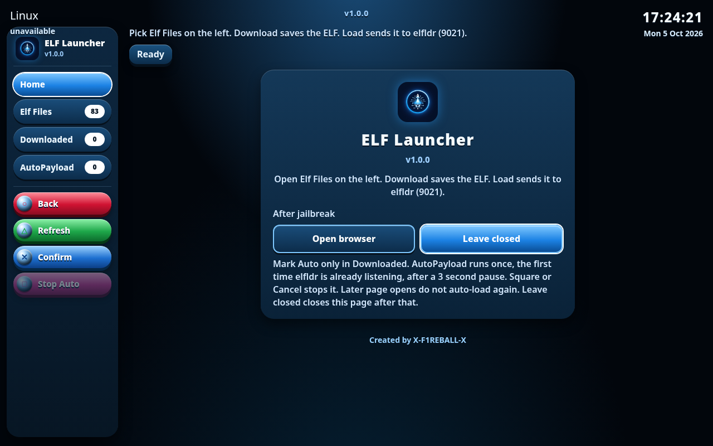

# Elf Launcher

## Preview

Live page: https://x-f1reball-x.github.io/elf-launcher/

**Elf Launcher 1.1.3**

Home-screen and browser ELF payload launcher for PS5.

- Release: https://github.com/X-F1REBALL-X/elf-launcher/releases/tag/1.1.3
- Pages: https://x-f1reball-x.github.io/elf-launcher/

## Downloads

- [elf-launcher.elf](https://github.com/X-F1REBALL-X/elf-launcher/releases/download/1.1.3/elf-launcher.elf)
- [elf-launcher-install.elf](https://github.com/X-F1REBALL-X/elf-launcher/releases/download/1.1.3/elf-launcher-install.elf)
- [elf-launcher-data.zip](https://github.com/X-F1REBALL-X/elf-launcher/releases/download/1.1.3/elf-launcher-data.zip)

## Usage

Install with the install ELF, or open the Pages host on the console browser and launch payloads from the catalog.

GitHub Pages publishes only the web UI from `docs/` (`index.html`, `payloads.json`, `icons/`, `screenshots/`); ELF binaries ship via Releases.