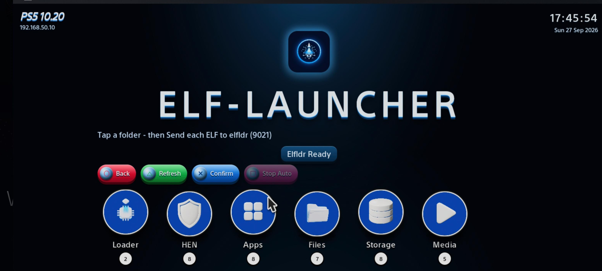

# elf-launcher

PS5 launcher for ELF payloads. Use it only after the console is already jailbroken.

  

- Repo: https://gitlab.com/X-F1REBALL-X/elf-launcher
- Latest release: https://gitlab.com/X-F1REBALL-X/elf-launcher/-/releases/v1.0.21
- GitLab Pages (browser UI): https://x-f1reball-x.gitlab.io/elf-launcher/

---

## What it is

`elf-launcher` is a home-screen tile plus a small HTTP UI on port **1000**. Open a folder, press **Send**, and the chosen ELF is loaded into elfldr. The same page also works from GitLab Pages in the PS5 browser when you only need Send.

Prefer the **home tile / `http://127.0.0.1:1000/`** when you want Kill, Update, offline use, and full controls. Prefer **GitLab Pages** when you only need Send from the browser.

From a phone or PC on the same LAN (or Pages), buttons say **Download** / **Multi download** instead of Send - files save to that device and are not sent to elfldr.

---

## First-time setup

1. Jailbreak the console (your usual WebKit / HEN path).
2. Start elfldr so it can receive payloads.
   - From this page on the PS5: open it and wait for **Elfldr Ready** (it boots elfldr for you), or
   - Send `loader/elfldr-ps5.elf` yourself to elfldr.
3. Install the home tile (recommended):
   - Download [elf-launcher.elf](https://gitlab.com/api/v4/projects/87119393/packages/generic/elf-launcher/1.0.21/elf-launcher.elf) from the [v1.0.21 release](https://gitlab.com/X-F1REBALL-X/elf-launcher/-/releases/v1.0.21).
   - Send it to elfldr. It installs the home-screen tile and serves the UI on port **1000**.
4. Optional: unpack [elf-launcher-data.zip](https://gitlab.com/api/v4/projects/87119393/packages/generic/elf-launcher/1.0.10/elf-launcher-data.zip) into `/data/elf-launcher` on the console (FTP). Needed if you want local copies of the payload folders on disk. **Data zip refreshed 2026-10-02** with catalog bumps (`ps5upload` v5.41.0, `Common_FPS_PS5` v1.2.1, `CheatRunner` v0.17.2, `payload-manager` v0.5.2, `webkit-autoloader-installer` v0.5.2, `ps5-app-dumper` v2.00); download from the [v1.0.10 release](https://gitlab.com/X-F1REBALL-X/elf-launcher/-/releases/v1.0.10).

After that, open the **elf-launcher** tile / `http://127.0.0.1:1000/`, or the Pages URL in the PS5 browser.

---

## Everyday use (PS5)

1. Jailbreak again if the console rebooted.
2. Open the UI (Pages or `:1000`).
3. Wait until status shows **Elfldr Ready**.
4. Open a folder (Loader, HEN, Apps, Files, Storage, Media, System, Tools).
5. Press **Send** on a row. The ELF is loaded into elfldr.
6. Optional: mark several rows with **Select**, then **Multi load** to send them one after another.
7. Optional: use **Auto** to remember a list; on first open those files send after 3 seconds. Use **Stop Auto** (or Square) to cancel.
8. **Send** always re-sends, even if the row already says **Active** or **Sent**.
9. **Kill** (PS5 + HTTP `:1000` only) stops that row's process by PID on the same server. Payload Manager is not required.

### Controller hints

- Circle: back
- Triangle: refresh
- Cross: confirm
- Square: cancel Auto load (same pink **Stop Auto** pad button)
- Auto payloads run only on first open; Refresh disables boot auto-run (re-check Auto and Send/Confirm to load again)

---

## Buttons

On the console UI at `http://127.0.0.1:1000/`:

- **Download** only when that ELF is not already in `/data/elf-launcher/mirror/`. It saves the file and does not send it to port 9021.
- **טען** when the file is already there. That sends the local ELF to elfldr on port 9021.
- **Update** only when the file exists and the catalog copy differs (checksum, or size if there is no checksum).
- **Kill** only while that ELF is actually running.
- Catalogs are fetched once on the first open. Opening the page again reuses that list. Triangle still refreshes on purpose.
- Same ELF filename and same version from two sources is listed once, preferring the author's own URL.
- **Pages vs :1000:** Download and טען that write or send from disk are `:1000` only. Pages still supports **Send** (via elfldr URI).
- **UI refresh:** Pages picks up HTML on next load (hard-refresh if cached). The home-tile `:1000` UI is embedded in `elf-launcher.elf` - reinstall that ELF after a UI rebuild to see the same glow on console.

## Ports

- **1000** - elf-launcher HTTP UI (local browser UI, full features including Kill)
- **elfldr** - receives / runs ELF payloads (started by the page or sent yourself)
- **2121** - FTP (etaHEN / ftpsrv), for copying `elf-launcher-data.zip` to `/data/elf-launcher`
- **8084** - Payload Manager (optional); Kill no longer depends on it

---

## Folders on the home screen

- **Loader** - elfldr and the launcher installer
- **HEN** - Jailbreak / HEN stacks (etaHEN, onionHEN, and related payloads)
- **Apps** - Homebrew installers and managers (PKG, Kura, Launchpad, ...)
- **Files** - FTP, web file managers, websrv, DNS
- **Storage** - Dump, mount, saves, ShadowMountPlus
- **Media** - Players and streaming app installers
- **System** - Reboot, rest mode, fan, power
- **Tools** - Debug, cheats, Remote Play, self-pager, ActRemoteLink
- **Auto** - (PS5 only) your saved auto-send list

---

## Downloads

Core launcher files:

- [elf-launcher.elf](https://gitlab.com/X-F1REBALL-X/elf-launcher/-/raw/main/launcher/elf-launcher.elf) (`1.0.21`) - installs the home screen tile and serves this page from the console
- [elfldr-ps5.elf](https://gitlab.com/X-F1REBALL-X/elf-launcher/-/raw/main/loader/elfldr-ps5.elf) (`v0.26`) - loads ELF payloads for the UI to send

Release assets and the rest of the catalog live in the repo folders and on the [v1.0.21 release](https://gitlab.com/X-F1REBALL-X/elf-launcher/-/releases/v1.0.21) page. Browse the tree or open the UI to pick payloads.

## Credits

- **X-F1REBALL-X** - elf-launcher, WK-AutoLoader, `reboot.elf`, `suspend.elf`

Upstream authors (specific work, not generic support):

- **ps5-payload-dev** - elfldr, ftpsrv, shsrv, websrv, gdbsrv, klogsrv, offact, fetchpkg, linkdev, launchpad, media installers, classic kstuff
- **EchoStretch** - kstuff-lite, ps5-app-dumper, dump_installer, dump_runner
- **itsPLK** - Payload Manager, WebKit Autoloader installer, PKG Manager; also ps5-payloads-mirror
- **idlesauce** - rp-get-pin, ps5-self-pager
- **Pharaoh2k** - ps5debug-NG
- **someguythatmods** - classic ps5debug
- **Drakmor** - ftpsrv NG fork, nanoDNS
- **seregonwar** - zftpd
- **owendswang** - ps5-web-file-manager (+ 7zip helper), ps5-fan-control
- **ItsBlurf** - BFpilot, BFplayer
- **manos555555** - ps5-ftp-server
- **phantomptr** - ps5upload
- **earthonion** - garlic-savemgr
- **juma-sayeh** - PS5-Game-Compressor
- **KarnerF** - SMPlusGui
- **notmaj0r** - CheatRunner
- **BestPig** - BackPork
- **porhe911** - Common FPS for PS5
- **MasterPS0** - Power payloads, PS5HostPayloads
- **StonedModder** - TM44, SystemStateManager
- **aydencharles** - onionHEN
- **etaHEN** - etaHEN (optional .bin)
- **ArkSama** - Lapy-JB-Daemon (via mirror)
- **robin2kk** - Goldengames PS5 Autoloader (optional)
- **ps5-linux** - ps5-linux-loader
- **NookieAI** - kura-loader-ps5
- **illusionyy** - ps-patch-system (Prospero loader)
- **n0llptr** - Playstation-5-Save-Mounter (`mounter.elf`)
- **KINGDKAK** - ProsperoPlayer
- **francoataffarel** - ActRemoteLink

All rights remain with original authors.
