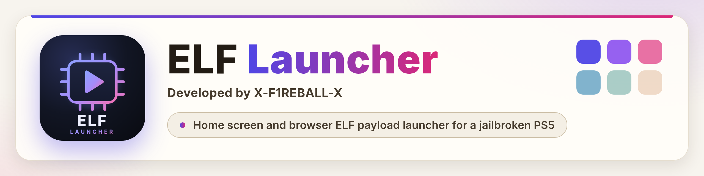

Home screen and browser ELF payload launcher for a jailbroken PS5.

## Quick start

1. Jailbreak and start elfldr on port `9021`.
2. Send `elf-launcher.elf` from the [latest release](https://github.com/X-F1REBALL-X/elf-launcher/releases/latest). It installs the home screen tile.
3. Open the tile, or `http://<PS5 IP>:1000` from your phone or PC.

Everything else, including what's new in 2.0.0, is in the [guide](https://x-f1reball-x.github.io/elf-launcher/docs/guide/).

Developed by X-F1REBALL-X.

[Support the project on Ko-fi](https://ko-fi.com/xf1reballx). The project stays free and open source.
